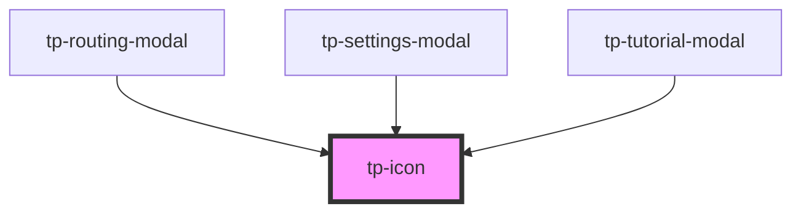

# tp-icon

<!-- Auto Generated Below -->

## Properties

| Property | Attribute | Description | Type  | Default     |
| -------- | --------- | ----------- | ----- | ----------- |
| `icon`   | `icon`    |             | `any` | `undefined` |

## Dependencies

### Used by

 - [tp-routing-modal](../tp-routing-modal)
 - [tp-settings-modal](../tp-settings-modal)
 - [tp-tutorial-modal](../tp-tutorial-modal)

### Graph

----------------------------------------------

*Built with [StencilJS](https://stenciljs.com/)*
