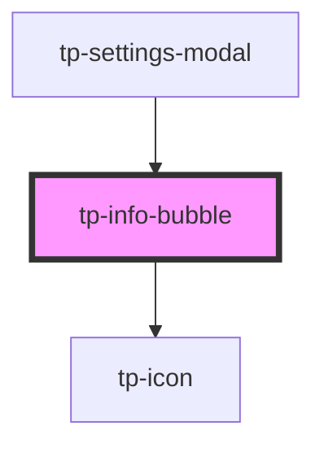

# tp-info-bubble

<!-- Auto Generated Below -->

## Properties

| Property  | Attribute | Description | Type     | Default     |
| --------- | --------- | ----------- | -------- | ----------- |
| `content` | `content` |             | `string` | `undefined` |

## Dependencies

### Used by

 - [tp-settings-modal](../tp-settings-modal)

### Depends on

- [tp-icon](../tp-icon)

### Graph

----------------------------------------------

*Built with [StencilJS](https://stenciljs.com/)*
