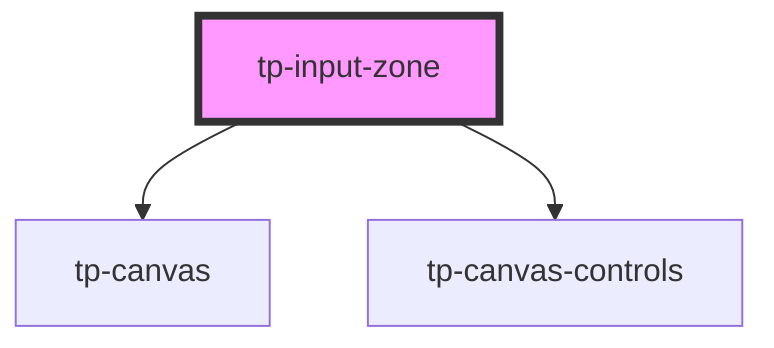

# tp-input-zone

<!-- Auto Generated Below -->

## Properties

| Property         | Attribute         | Description | Type     | Default     |
| ---------------- | ----------------- | ----------- | -------- | ----------- |
| `characterLimit` | `character-limit` |             | `number` | `undefined` |
| `round`          | `round`           |             | `number` | `undefined` |
| `sendingTo`      | `sending-to`      |             | `string` | `undefined` |

## Dependencies

### Depends on

- [tp-canvas](../tp-canvas)
- [tp-canvas-controls](../tp-canvas-controls)

### Graph

----------------------------------------------

*Built with [StencilJS](https://stenciljs.com/)*
