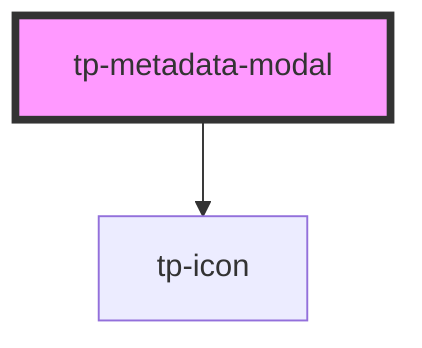

# tp-metadata-modal

<!-- Auto Generated Below -->

## Properties

| Property   | Attribute       | Description | Type                                     | Default     |
| ---------- | --------------- | ----------- | ---------------------------------------- | ----------- |
| `enabled`  | `modal-enabled` |             | `boolean`                                | `undefined` |
| `gameid`   | `gameid`        |             | `number`                                 | `undefined` |
| `metadata` | --              |             | `{ date: string; roundLength: number; }` | `undefined` |

## Dependencies

### Depends on

- [tp-icon](../tp-icon)

### Graph

----------------------------------------------

*Built with [StencilJS](https://stenciljs.com/)*
