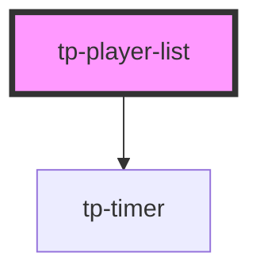

# tp-player-list

<!-- Auto Generated Below -->

## Properties

| Property    | Attribute    | Description | Type                                        | Default     |
| ----------- | ------------ | ----------- | ------------------------------------------- | ----------- |
| `addTime`   | --           |             | `() => void`                                | `undefined` |
| `isHosting` | `is-hosting` |             | `boolean`                                   | `false`     |
| `players`   | --           |             | `Player[]`                                  | `[]`        |
| `roundData` | --           |             | `{ roundnumber: number; endTime: number; }` | `undefined` |
| `stuck`     | `stuck`      |             | `boolean`                                   | `false`     |

## Dependencies

### Depends on

- [tp-timer](../tp-timer)

### Graph

----------------------------------------------

*Built with [StencilJS](https://stenciljs.com/)*
