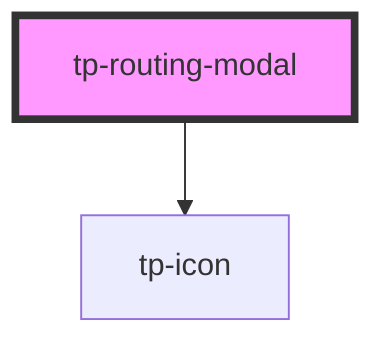

# tp-routing-modal

<!-- Auto Generated Below -->

## Properties

| Property   | Attribute       | Description | Type                                | Default     |
| ---------- | --------------- | ----------- | ----------------------------------- | ----------- |
| `enabled`  | `modal-enabled` |             | `boolean`                           | `undefined` |
| `firebase` | --              |             | `BYFOFirebaseAdapter`               | `undefined` |
| `rejoin`   | --              |             | `{ gameid: string; name: string; }` | `undefined` |
| `type`     | `modal-type`    |             | `"host" \| "join" \| "result"`      | `undefined` |

## Dependencies

### Depends on

- [tp-icon](../tp-icon)

### Graph

----------------------------------------------

*Built with [StencilJS](https://stenciljs.com/)*
