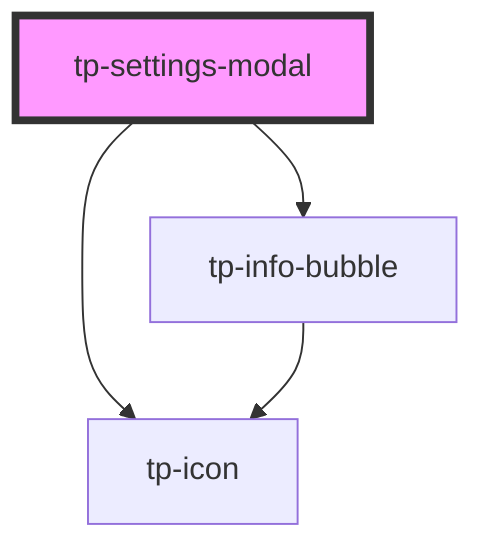

# tp-settings-modal

<!-- Auto Generated Below -->

## Properties

| Property    | Attribute       | Description | Type                                            | Default     |
| ----------- | --------------- | ----------- | ----------------------------------------------- | ----------- |
| `buildDate` | --              |             | `{ year: string; full?: string; date?: Date; }` | `undefined` |
| `enabled`   | `modal-enabled` |             | `boolean`                                       | `undefined` |
| `store`     | --              |             | `TPStore`                                       | `undefined` |

## Dependencies

### Depends on

- [tp-info-bubble](../tp-info-bubble)
- [tp-icon](../tp-icon)

### Graph

----------------------------------------------

*Built with [StencilJS](https://stenciljs.com/)*
