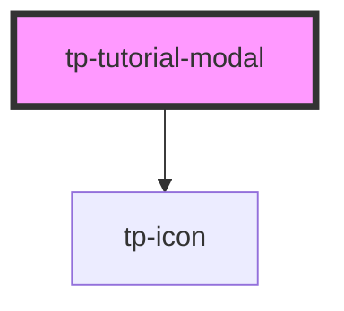

# tp-tutorial-modal

<!-- Auto Generated Below -->

## Properties

| Property  | Attribute       | Description | Type      | Default     |
| --------- | --------------- | ----------- | --------- | ----------- |
| `enabled` | `modal-enabled` |             | `boolean` | `undefined` |

## Dependencies

### Depends on

- [tp-icon](../tp-icon)

### Graph

----------------------------------------------

*Built with [StencilJS](https://stenciljs.com/)*
